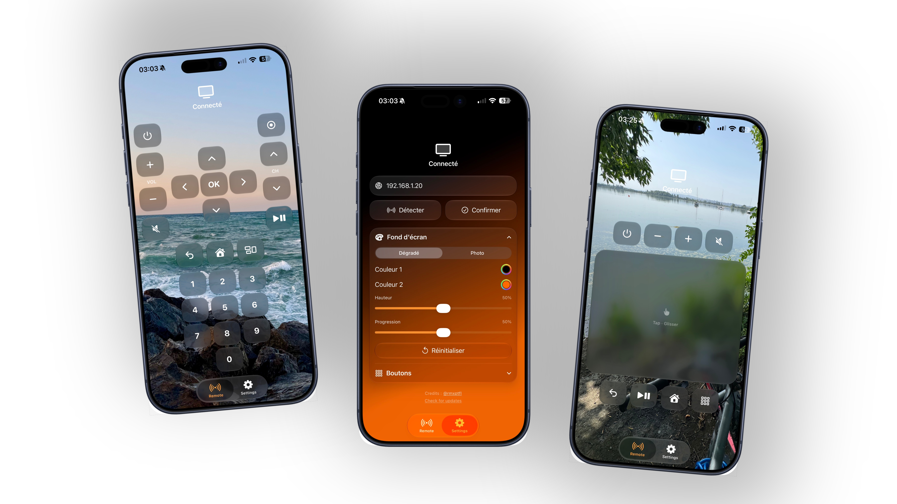

# RemoteGlass
Simple remote app for Orange France TV decoders and GoogleTV/AndroidTV devices, built (vibecoded) 100% in Swift.

## Features
- Local
- No login
- Liquid Glass
- Should work with all Orange decoders (Currently tested with Livebox 5's UHD Decoder)
- Works with all GoogleTV/AndroidTV devices using the AndroidTV Remote v2 protocol (every single of them except Amazon FireTV devices, I guess)
- Multi devices pairing
- Customizable background with gradient or photo
- Haptic feedbacks
- ADS FREE
- Compact mode with TrackPad
- Squircle or Circular buttons

## Installation
Grab the latest .ipa in the Releases section and install it with any sideloading method (ALtStore, SideStore, Sideloadly,..). Also works completely fine inside LiveContainer.

OR

Join the TestFlight build.
https://testflight.apple.com/join/q1VHxx5y

## Usage
- Click "Detect"
- Choose your Decoder ip or your Google TV device name
- Orange : Test if it's the right one and click Confirm
- GoogleTV : Enter the PIN and confirm

## Known issues
The touch response shape has a higher corner radius than the actual remote buttons, that's an intrinsic Liquid Glass flaw from Apple for every non-circular shapes, Apple fixed that with iOS 27.

The latest version includes two solutions for iOS 26 users.
- Circular icons option
- Disabling the HDR highlight and the button stretching in response to touch

On iOS 27, the app icon won't change despite the pop-up saying otherwise, until you respring/restart your iPhone. 
That's an iOS 27 bug that will likely be fixed in an upcoming beta.

While using a white-based gradient, the buttons behind the white part become clearer than the others, I really don't know how to fix this while keeping a native Liquid Glass rendering.
